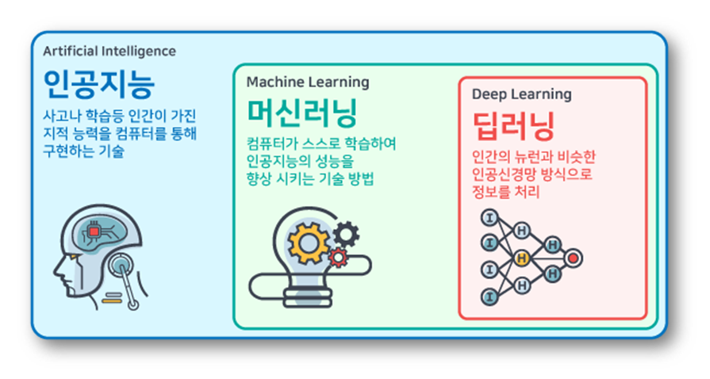
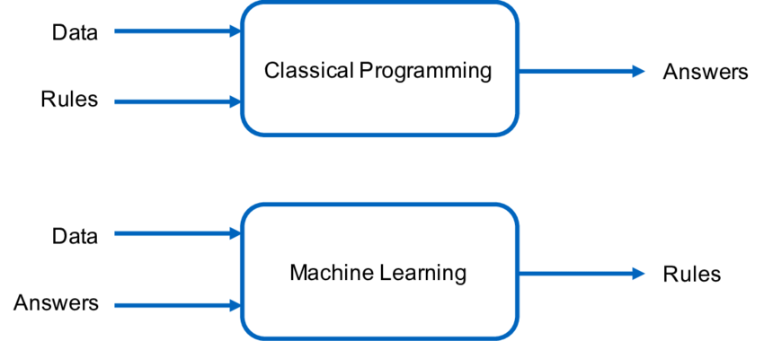
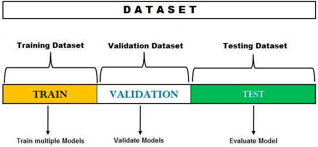
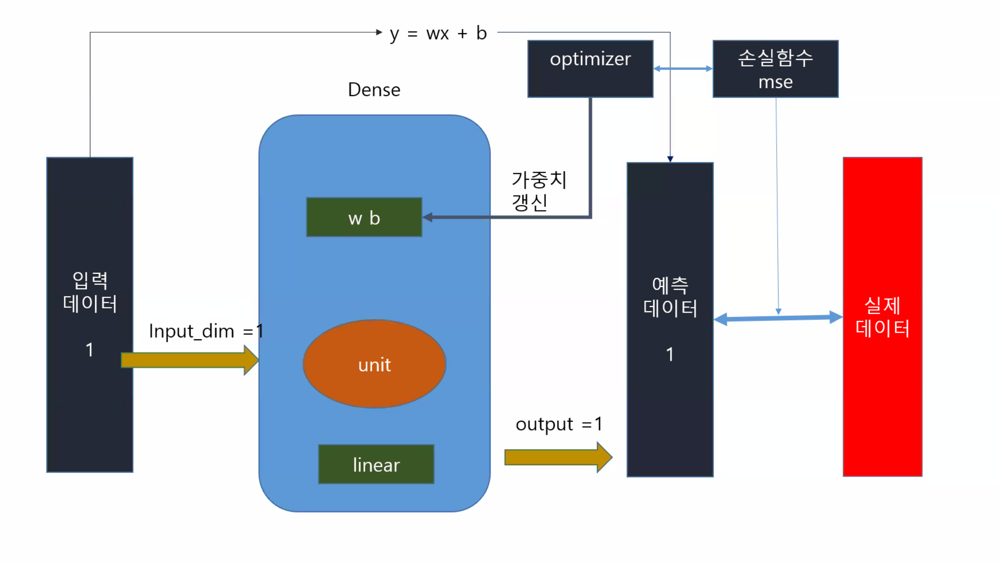

# 0824 딥러닝

> 딥러닝 입문 with 텐서플로우 2.x

### 시작하며



* 자바를 공부한 사람들이 많지 않다...



보스톤의 집 값은 정답.

#### 텐서플로우

> 막강한 api를 통해 어떤 train 데이터를 학습을 시켜서 모델의 정확도를 높이는 것으로 사용함.

* 일반인 얼굴을 찍은 것을 사용한다? 법적으로 위배됨

### 케라스란?

> 최종적으로 모델을 만드는게 중요한데...

* 모델을 만드는 과정
  1. 학습 데이터를 준비 -> data preparing, preprocessing
  2. 문제를 해결하기 위한 모델을 정의 -> Model(Sequential, Functional API)
  3. 손실함수, 옵티마이저를 설정->compile()
  4. 모델을
  5.  학습시키고, 추론 -> fit(), evaluation(), predict()

## [설정 과정]

* 램16기가 확인
* 아나콘다 설치
  * 관리자 권한으로 실행 - all user - 프로그램데이터/아나콘다3
  * add 체크!
  * 설치 
  * 다 체크 완료
* 한글 텍스트 분석
  * https://www.oracle.com/java/technologies/javase/javase-jdk8-downloads.html
  * Windows x64	169.46 MB

* 고급 시스템 설정 - 환경변수

  * parh에서 python36이 젤 위에

* cmd로

  ```powershell
  python -V 버전 확인
  3.8.8
  ```


### 케라스 준비하기

* 파이참 접속
  * conda 선택 - 버전 3.8
  * 세팅 - python Interpreter


## 머신러닝 프로세스 간략히 살펴보기

> 문제 정의 및 데이터 준비하기 - 학습하기 - 추론 및 평가

### 1. 데이터 준비하기

#### 과소표집과 과대표집

.png)

* 과소표집
* 과대표집

#### 회귀와 분류

#### 원핫 인코딩(One Hot encoding)

* 원핫 인코딩
* min max -정규화
* 결과값 도출

#### 교차검증(cross-validation)




## tensorflow 실습

```python
from tensorflow.keras import Sequential;
from tensorflow.keras.layers import Dense; # dense는 밀도를?

# 가장 기본적인 세팅
model = Sequential();
model.add(Dense(units=1, activation='linear', input_dim=1));
model.compile(optimizer='adam',loss='mse', metrics=['mae']);
model.fit(x_train, y_train, epochs=300, verbose=0);

```

## 신경망




###  퍼셉트론

> p.71

### 다층 퍼셉트론


* `hidden layer`들 + `output layer`  : 마지막 `dense`는 결과를 도출해내는 도출

## 케라스에서의 개발 과정

> p.84

```python
model = Sequential()
model.add(Dense(32, input_shape = (2,), activation = 'relu')) # hidden layer
model.add(Dense(1, activation ='sigmoid'))
```

* 단층 퍼셉트론


* 은닉층의 추가


* 평균 제곱 오차 회귀 문제
  * loss = mse

* 이항분류 문제
  * loss = binary_crossentropy

* 다항 분류 문제
  * loss = categorical_crossentropy

## 교차검증

