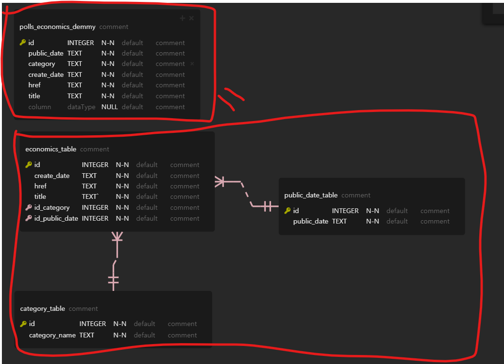

# 0831 파이널 프로젝트 1

## 안내사항

### 팀프로젝트리스트

1. 소통은 구글 드라이브의  스프레트시트를 이용
   * 질문은 `질문자` `묻는 내용` `답변`
   * 강사님 회의 예약은 예약자, 회의 참석 예약으로 장소와 시간 내용 담기
   * 구글 드라이브의 엑셀 파일에는 두가지 시트
2. 묻고 답하기 회의실이 있음 - 개인적으로 여쭤봐야하는 상황
   * 장소 : 묻고 답하기
   * 내용 : 스크래핑 관련 문의입니다.
   * 소스를 깃에 올리고서 URI를 강사님께 드리고 문의하기
3. 노란색으로 표시가 되면 확인이 되었다는 표시

### 프로젝트 디스크립션

1. 어느 항목까지 진행되야하는지 나와야 하는 것을 서술.

### 프로젝트의 목표

1. 프로젝트는 경험이다!
2. way of communcation 을 이해해야하는 것이 목표
3. 현장에서 팀플을 하면서 가장 많이 부딪히는 것은 `사람`
4. 해봤던 것을 해도 좋고 그렇지 않은 것을 해도 좋음. 프로젝트를 진행하고 접하는 방법
5. 실제 프로젝트에서 PM 분들을 하셨던 분들은 조율자의 역할...
6. PM은 프로젝트에서 한발 뒤에서...
7. 주제를 드리면...주제를 가지고 그것만 갖고 이야기를 해야...
   1. 세부 주제를 회의 들어가기 전에... 생각나는 대로...
   2. 회의는 회의 같이 해야함.
8. 브레인스토밍...생각 없이... 막 던지기!

### 프로젝트...어떻게?

* 고정과 선택----! 원래 프로세스에는 없음...

* 고정 : 주제가 결정되었는가?

  > 취업 포털 추천 사이트

  * 스크래핑은...우리가! 
  * 강사님께서 디스플레이를 만들어보이심!
  * 어떻게 개인에게 추천을 할지 고민을 함.
  * 스크래핑, 추천 고민...!
  * 이번에 만들어질 사이트는 로그인이 구현이 되어야 함.
  * 데이터를 우리라도 모아서...!

* 선택 : 결정되지 않았는가?

## 브레인스토밍 : 0831

* 선택 주제의 선정

  > 1. 팀명 선정
  > 2. 무엇을 만들지? 
  > 3. PM 선정
  > 4. 소통 : 카톡과 Github, google Drive
  > 5. 업무 분장 : PM, 스크래핑, 웹서버(Front/back), 머신러닝
  > 6. 강사와 미팅

* 작성 문서

  * 마인드맵
  * 깃헙 README.md
    * 멤버 업무분장
    * 주제와 해결하려는 문제

## 결과물

* 팀 과제
  * 스크래핑 : 2사이트 이상 웹 화면 표시
  * DB 사용
  * 웹서버 (front/backend) : 통계 차트 2개 이상
  * Deeplearning, Pickle, h5 file, 서비스화면
* 개별 과제
  * 각 팀원 별 Class, Function 1개 이상

## 업무 분장

* 스크래핑은 매일 매일 돌아가야 함.
* 업무 분장에 어느 정도까지가... 프론트고 백엔드고 
* 실제 프로젝트를 하면서 어느 분야가 어느 정도까지 진행되야하는지...
* 시간 조절...

## 브레인 스토밍

> Tool은 `Mindmup`을 이용해서....

* 마인드 맵 : 브레인 스토밍(상대 의견에 대해 )
  * Purpose : 주제
  * People : 업무분장
  * Risks : 개발 시 장애요인
  * Scope, Timescales : 개발 범위, 이유

# 0901 파이널 프로젝트 2

## 문서 작성

1. PM이 `order`를 주고 문서를 남기게 됨.
2. 문서를 주세요. 문서로 남겨서 주세요. -> argu의 다툼을 막기 위해서...

## 요구사항 정의서

1. 이런 내용을 만들어주세요. 요청하는 서류
2. 작은 도서관 사이트...봉사활동 = 구현방안이 요청한 사안...!


* `출처` 는 누가 요구했는지?
* 수용은 OK / 보류는...
* `요구사항`만 작성하고 `비고`는 어디에 구현을 할지만!
* 스크래핑에서 구현까지 전부 다 하도록
* 요구사항 ID는 안해도 됨!

## 와이어프레임(WireFrame)

1. 와이어프레임 툴

# 0902 파이널 프로젝트3

## 금일의 과제 내용

* ERD 툴
* 인터페이스 데피니션

## 장고에서의 DB 세팅

* 항상 디버깅 모드로 창을 띄어라!
* python manage.py runserver 80 이거 대신 manage .py - 파이참 상단 [manage ▼] - edit configuration - parameters 옆에 runserver 입력

* manage.py 에디팅
* DB Browser 세팅
  * settings - plugin - database navigator - restart
* DB 브라우저에서 +
  * ... 클릭 - db.sqlite 지정
  * Extract SQL statement - select SQL - RUN

## 장고의 기능

### Paginator

> paginator는 list를 기준으로 동작함.

```python
from django.core.paginator import Paginator

objects = ['john', 'paul', 'george', 'ringo', 'jane', 'mag']

page = Paginator(objects, 2)

print(type(page)) # 디버깅모드
```

* 범위 [총 개수/페이지 수]
  * 화면에 내용을 띄어주는 것
  * 페이지의 갯수
* 디버깅 모드 활용법
  * 변수 확인 방법 브레이크 포인트 설정 후 콘솔을 눌러서 확인

```powershell
Connected to pydev debugger (build 212.4746.96)


type(page)
Python 3.6.4 (v3.6.4:d48eceb, Dec 19 2017, 06:54:40) [MSC v.1900 64 bit (AMD64)]
Type 'copyright', 'credits' or 'license' for more information
IPython 7.16.1 -- An enhanced Interactive Python. Type '?' for help.
PyDev console: using IPython 7.16.1
Out[1]: django.core.paginator.Paginator


In[2] : page.count
Out[2]: 6


In[3] : page.num_pages
Out[3]: 3

In[4] : page.page(2) 	# 난 두번째 페이지를 보고 싶어
Out[4]: <Page 2 of 3>

# 페이지 2에서 변수를 담고 싶어 
page2 = page.page(2)

In[6] :type(page2)
Out[6]: django.core.paginator.Page

# for문은 무조건 리스트여야 가능!!

In[7]: page2.object_list
Out[7]: ['george', 'ringo']

# 딕셔너리로!!!
```

* 다음 페이지에 있냐!?

```python
In[8] : page2.has_next()
Out[8]: True
# 페이지의 처음과 끝을 표시할때 이것을 활용함.

page2.has_previous()
Out[9]: True
```

* 앞에도 페이지가 있고 뒤에도 페이지가 있어서 이렇게 양쪽다 `True`가 나오게 됨.

### 이제 실전

* 장고에서는 외부에서 요청을 받기때문에 `request`
* 

```python
from django.core.paginator import Paginator

def list_paginator(request):
    conn = sqlite3.connect('db.sqlite3') # DB 연결
    conn.row_factory = sqlite3.Row  # for getting columns sqlite에서는 넣어야함.
    curs = conn.cursor()				# 커서로 변수를 가져옴
    curs.execute('select * from polls_economics pe') 
    # 커서를 잡아오기 위해 `execute`를 사용 = SQL문
    data = curs.fetchall()
    # select한 변수를 전부 담아주는 fetchall


    return
```

* 딕셔너리는 `key`와 `value`로
* urls.py에 추가

```python
    path('board/list_paginator', boardviews.list_paginator),
```

#### 이제는 다시 manage.py에서 디버깅모드

* http://127.0.0.1:8000/board/list_paginator

```python
type(row)
Python 3.6.4 (v3.6.4:d48eceb, Dec 19 2017, 06:54:40) [MSC v.1900 64 bit (AMD64)]
Type 'copyright', 'credits' or 'license' for more information
IPython 7.16.1 -- An enhanced Interactive Python. Type '?' for help.
PyDev console: using IPython 7.16.1
Out[1]: sqlite3.Row

    
type(data)
Out[2]: list
```

#### 이제 완성

```python
from django.core.paginator import Paginator

def list_paginator(request):
    conn = sqlite3.connect('db.sqlite3')
    conn.row_factory = sqlite3.Row  # for getting columns
    curs = conn.cursor()
    # economics
    curs.execute('select * from polls_economics pe')
    data = curs.fetchall()
    for row in data:
        print(row['title'], row['href'])
    paginator = Paginator(data, 5)
    result = dict()
    result['paginator'] = paginator
    return render(request, 'board/list_paginator.html', context=result)
```

#### 이제 html로 [board/list_paginator.html]

```html
<!DOCTYPE html>
<html lang="en">
<head>
    <meta charset="UTF-8">
    <title>Title</title>
</head>
<link rel="stylesheet" href="https://stackpath.bootstrapcdn.com/bootstrap/4.3.1/css/bootstrap.min.css"
    integrity="sha384-ggOyR0iXCbMQv3Xipma34MD+dH/1fQ784/j6cY/iJTQUOhcWr7x9JvoRxT2MZw1T" crossorigin="anonymous">

<body>
<div class="container">

    <table class="table table-striped">
        <thead>
            <tr>
                <th>title</th>
                <th>links</th>
            </tr>
        </thead>
        <tbody>
            <tr>
                <td></td>
                <td></td>
            </tr>
        </tbody>
    </table>

    <ul class="pagination">
        <li class="page-item active"><a class="page-link" href="#">Page  of </a></li>
        <li class="page-item"><a class="page-link" href="?page=">Next</a></li>
        <li class="page-item"><a class="page-link" href="?page=">last &raquo;</a>
        </li>
    </ul>
</div>
</body>
</html>
```

* `container `: 센터를 잡음
* `table` : class
* `ul` : paginator

### 페이지네이션 구현

페이지 네이터와 페이지의 갯수를 넘겨야함.

```html
		 <tbody>
            
            <tr>
                <td>{{ row.title }}</td>
                <td>{{ row.href }}</td>
            </tr>
            
        </tbody>
```

* 변수는 {{ }}

#### 지금은 페이지 부분

1. 자기 페이지가 뭔지 표기 하기(현재 페이지)

```html
        <li class="page-item active"><a class="page-link" href="#">Page {{ page_obj.number }}  of {{ paginator.num_pages }}</a></li>
```

* Page {{ page_obj.number }}  of {{ paginator.num_pages }}

2. 다음 페이지 표시
   * GET 방식으로 받기

```html
        <li class="page-item"><a class="page-link" href="?page={{ page_obj.next_page_number }}">Next</a></li>
```

#### 최종적인 list_paginator

```python
def list_paginator(request):
    conn = sqlite3.connect('db.sqlite3')
    conn.row_factory = sqlite3.Row  # for getting columns
    curs = conn.cursor()
    # economics
    curs.execute('select * from polls_economics pe')
    data = curs.fetchall()
    for row in data:
        print(row['title'], row['href'])
    paginator = Paginator(data, 5)
    result = dict()
    result['paginator'] = paginator
    # request.GET['page']
    page_number = request.GET.get('page', 1)
    result['page_obj'] = paginator.get_page(page_number)
    return render(request, 'board/list_paginator.html', context=result)
```

## DB 설계

### 건축에서 설계서를 만드는 이유

* 일관성을 만들기 위해서
* 문서가 다음 사람에게 
* 글로 작성하기 때문에, 오해가 발생할 수 있다.

#### DB의 설계도를  ERD를 통해 보게 됨.

* DB 설계도를 못본다, DB를 못만든다!

### DB 설계

1. Story book 혹은 ERD 클라우드로 table 설계 후 Export

2. 파이탐에서 DB 브라우저 

   * auto-commit 체크
   * connection CREATE TABLE
   * reload

3. 컬럼 설계

   * category : 별도의 테이블
   * public_date : 별도의 테이블
   * title : 값이 겹치는지? - 스크래핑의 문제 자료의 문제가 아님 - duplication으로 없애야함.

4. RDB는 주체를 생각할수 있어야함. - 어떻게든 연결고리가 있어야하는 것이 특징!

5. 각 테이블의 유니크한 값+ 숫자에 `PRIMARY_KEY`설정

   

6. ONE N : 1대 다(多) 를 나타내는 표시

   * `작은_TB`에서 `원래_TB`로!



* 같은 TABLE 하지만 관계형 DB로 변환
* Story book을 통해 SQL문 EXPORT

```mysql
CREATE TABLE category_table
(
  id            INTEGER NOT NULL,
  category_name TEXT    NOT NULL,
  PRIMARY KEY (id)
);

CREATE TABLE economics_table
(
  id             INTEGER NOT NULL,
  create_date    TEXT    NOT NULL,
  href           TEXT    NOT NULL,
  title          TEXT`   NOT NULL,
  id_category    INTEGER NOT NULL,
  id_public_date INTEGER NOT NULL,
  PRIMARY KEY (id)
);

CREATE TABLE polls_economics_demmy
(
  id          INTEGER NOT NULL,
  public_date TEXT    NOT NULL,
  category    TEXT    NOT NULL,
  create_date TEXT    NOT NULL,
  href        TEXT    NOT NULL,
  title       TEXT    NOT NULL,
                      NULL    ,
  PRIMARY KEY (id)
);

CREATE TABLE public_date_table
(
  id          INTEGER NOT NULL,
  public_date TEXT    NOT NULL,
  PRIMARY KEY (id)
);

ALTER TABLE economics_table
  ADD CONSTRAINT FK_category_table_TO_economics_table
    FOREIGN KEY (id_category)
    REFERENCES category_table (id);

ALTER TABLE economics_table
  ADD CONSTRAINT FK_public_date_table_TO_economics_table
    FOREIGN KEY (id_public_date)
    REFERENCES public_date_table (id);
```

* DB 생성 순서

  1. 참조한 TB 먼저!

     * category_TB

     ```sqlite
     CREATE TABLE category_table
     (
       id            INTEGER NOT NULL,
       category_name TEXT    NOT NULL,
       PRIMARY KEY (id)
     );
     ```

     * public_date_TB

     ```sqlite
     CREATE TABLE public_date_table
     (
       id          INTEGER NOT NULL,
       public_date TEXT    NOT NULL,
       PRIMARY KEY (id)
     );
     ```

     * economics_TB

     ```sqlite
     CREATE TABLE economics_table
     (
       id             INTEGER NOT NULL,
       create_date    TEXT    NOT NULL,
       href           TEXT    NOT NULL,
       title          TEXT   NOT NULL,
       id_category    INTEGER NOT NULL,
       id_public_date INTEGER NOT NULL,
       PRIMARY KEY (id)
     );
     ```

  2. 제약 조건

     > `sqlite`는 제약조건의 관계설정은 어렵지만, 제약조건은 테이블에 설정할 수 있음.

  ```sqlite
  CREATE TABLE economics_table
  (
    id             INTEGER NOT NULL,
    create_date    TEXT    NOT NULL,
    href           TEXT    NOT NULL,
    title          TEXT   NOT NULL,
    id_category    INTEGER NOT NULL,
    id_public_date INTEGER NOT NULL,
    PRIMARY KEY (id),
     FOREIGN KEY (id_category)
      REFERENCES category_table (id),
     FOREIGN KEY (id_public_date)
      REFERENCES public_date_table (id)
  );
  ```

  ### 그렇담 이제 TEST

  1. connection 우클릭 - new SQL 
  2. economics_TB 에서 insert SQL문 
  3. 이제 value를 지정해서 넣어보기!

#### DB에는 더미 데이터를 넣어봄이...


## 스크래핑 결과를 DB의  `TB`에 넣기

1. 하루에 특정 만큼 스크래핑을 함.

```python
!python -m pip install schedule
```

2. 함수 정의

```python
import schedule
import time

def job01():
    print('job01() working ....')
    # return
```

3. `while`문 정의

```python
while True:
    schedule.run_pending()
    time.sleep(1)
```

4. 스케줄 등록하는 방법

```python
schedule.every(1).minutes.do(job01)
# 1분 마다 job01
```

5. 특정시간대 과업 등록

```python
schedule.every().day.at('14:30').do(job01)
```


### 백엔드/프론트엔드 : 인터페이스 정의서(다음주 까지~)


> 주로 BackEnd 가 작성 : 이렇게 혼란 스럽지 않게!
>
> 최소 2개는 시트를 만든다.

1. views : 백엔드
2. html : 프론트엔드

## RDB로 하는 이유!!!

1. Key를 제대로 넣었을때와 넣지 않았을때의 차이를 비교해보자!
   * category
   * public_date
2. 데이터 `INSERT`

```sqlite
# 넣기

insert into public_date_table(
    public_date) 
    values(
    '20211030')
;

insert into category_table (
    category_name)
values (
    '정치')
;


insert into category_table (
    category_name)
values (
    '스포츠')
;
# 확인
select
    ct.category_name,
    ct.id
from
    category_table ct;

select
    pdt.id,
    pdt.public_date
from
    public_date_table pdt;

```

```
```

```sqlite
insert into economics_table (
    create_date,
    href,
    id_category,
    id_public_date,
    title)
values (
    '2021-09-02 05:06:52',
    'https://news.v.daum.net/v/20210902094246843',
    1,
    2,
    '"물류대란 막자"..HMM 노사 협상개시 77일만에 최종타결')
;
```

```sqlite
select
    et.create_date,
    et.href,
    et.id,
    et.id_category,
    et.id_public_date,
    et.title
from
    economics_table et;
```

* join 해서 보기

```sqlite
select * 
from
    economics_table et
    inner join public_date_table pdt
    on et.id_public_date = pdt.id
    inner join category_table ct
    on et.id_category = ct.id
    ;
```

## 고정 주제 관련

1. 내일 오전 시작 전에 
2. 한 분이 스크래핑을 맡아서 해주셔야 함.
3. 팀 내에서 한 명만 고정-스크래핑만 하실 수 있게!


# 0903 파이널프로젝트 4

## 전달사항

* 주제 정하고, 기획안 까지는 오늘 나와야함.
* ERD까지는 나오는게 좋음
* 인터페이스 정의서는 아직
* 지정 주제 두분만 미팅을 따로 진행할 예정.

# 0906 파이널프로젝트 5

* WBS 작성
* 와이어프레임 - 웹페이지의 이동경로
